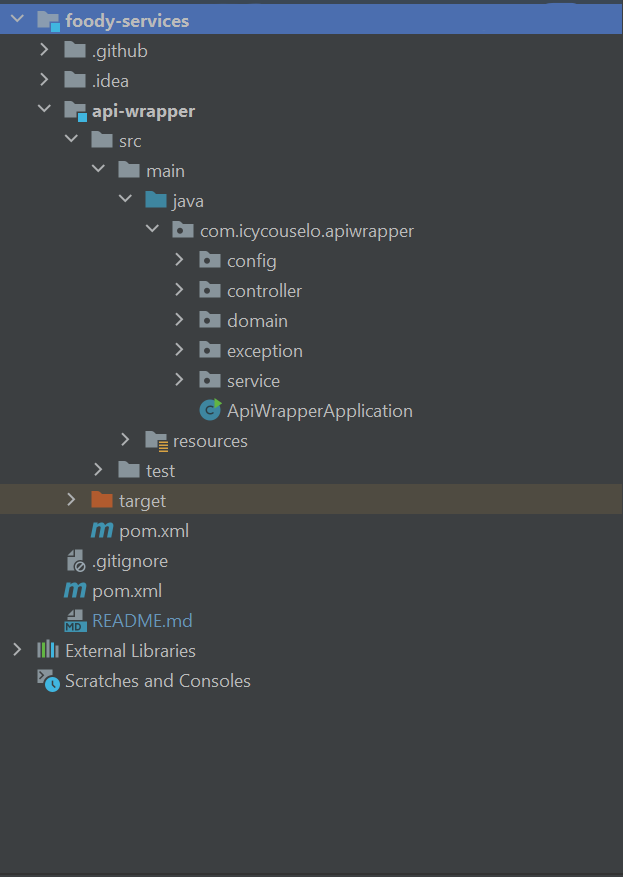

An application to retrieve a recipe from a specific URL and extract the recipe metadata.
**TODO:** Write more detailed description.

# Requirements:
* Java 17
* Maven
* Docker

# Project structure:



# How to Run:


Build the application with ``mvn package`` in the root directory of the project. This will generate executable jar files in the ``/target``
folder of the different modules.
# Rest API endpoints: 

View OpenApi specifications at:
``/swagger-ui.html``

# To run integration-tests:

```
mvn clean integration-test
```